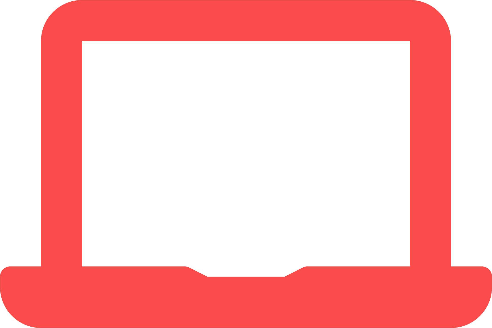

<!DOCTYPE html>
<html lang="en">

<head>
    <meta charset="UTF-8">
    <meta name="viewport" content="width=device-width, initial-scale=1.0">
    <title>Cotton Design and Development</title>
    <link rel="stylesheet" href="styles.css">
    <link href="https://fonts.googleapis.com/icon?family=Material+Icons" rel="stylesheet">
</head>

<body>
    

        

            <header class="main-header">
                <nav class="main-nav">
                    
                    <ul class="navbar-items">
                        <li><a href="index.html" class="navbar-items-item">Home</a></li>
                        <li><a href="#pricing" class="navbar-items-item">Pricing</a></li>
                        <li><a href="#contact" class="navbar-items-item">Contact</a></li>
                    </ul>
                </nav>
                <a href="https://discordapp.com/invite/85ZFBNj" class="click-button">
                    CLICK HERE
                </a>
            </header>
            <section class="home-main-section">
                

                    <h1 class="title">Cotton Design &  Development Studio</h1>
                    

                        

                            
                            Graphic Design
                            <!-- 
                                expand_more
                             -->
                        

                        

                            
 
                                Front-End Development

                            <a href="#pricing" class="learn-more-btn">Learn More</a>
                        

                    

                    
A SERVICE BY COTTON DEVELOPMENT TEAM

                

                

            </section>
        

    

    <section class="product-listing">
        

            <h2 id = "pricing">Find a product</h2>
            

                

                    
 design

                    Website Design, Logo Design, UI/UX Design, etc.
                    

                    

                        
STARTING AT  $25

                        

                            
                        

                    

                

                

                    
development

                    Front-end website development
                    

                    

                        
STARTING AT  $25

                        

                            
                        

                    

                

                

                    
design + development

                    Website Design and front-end development
                    

                    

                        
STARTING AT  $50

                        

                            
                        

                    

                

            

        

        <section class="end-page">
            

                

                    <h3 id="contact">Our goal is simple.</h3>
                    
To persuade potential customers in buying   from you through your website 

                    

                        <a href="https://discord.gg/85ZFBNj">https://discord.gg/85ZFBNj</a>
                        <a href="https://discord.gg/85ZFBNj">Click here to join the server</a>
                    

                

            

        </section>
    </section>

    
    
    
    
</body>

</html>
